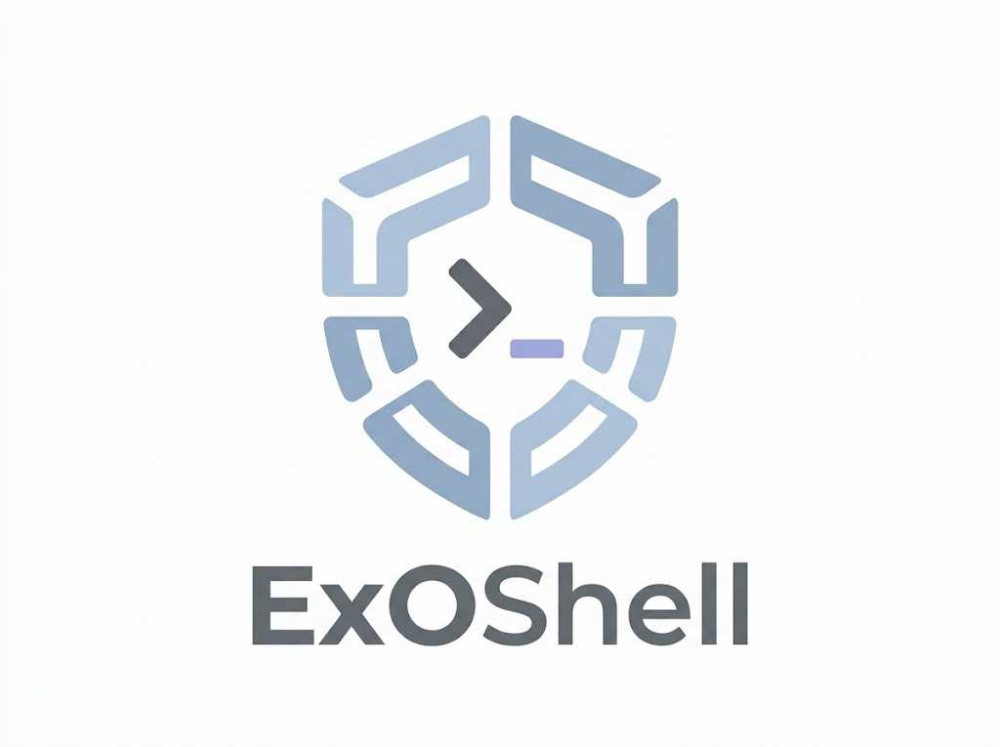

<!-- markdownlint-disable MD033 MD041 -->

<picture>
  <source media="(prefers-color-scheme: dark)" srcset="docs/brand/assets/ExOShell-dark.jpg">
  <source media="(prefers-color-scheme: light)" srcset="docs/brand/assets/ExOShell-light.jpg">
  
</picture>

<!-- markdownlint-enable MD033 MD041 -->

# ExOShell

https://github.com/Tojaj/ExOShell

ExOShell runs Codex, Claude Code, and OpenCode against local projects in NVIDIA
OpenShell sandboxes. It brings together provider profiles, sandbox policies,
a custom image, and a launcher that mounts the project and starts the selected
agent using rootless Podman.

Coding agents bring an entire software stack onto your machine: the agent CLI,
its dependencies, and the tools it runs. A mistaken command, malicious
instructions hidden in project content, or a compromised dependency can all
turn that access against you. ExOShell runs this stack in an OpenShell sandbox,
limiting host filesystem access and keeping supported long-lived credentials
outside the agent's reach.

OpenShell provides the sandbox isolation; ExOShell makes it practical for
everyday local agent work without assembling mounts, policies, credentials, and
agent setup for each run:

- **Focused project access.** Mount only the selected project by default, or
  explicitly share a larger source tree when the agent needs it.
- **Isolated, disposable sessions.** Each agent runs as a non-root user in its
  own rootless Podman sandbox. The sandbox and agent runtime state are removed
  when it exits; edits to the mounted project remain.
- **Ready-to-run tools.** Use an image with the coding agents and supporting CLIs
  already installed, so each session starts with a consistent toolset.
- **Visible network boundaries.** Audit general agent traffic and enforce the
  endpoints where provider-managed credentials can be used.
- **Protected long-lived credentials.** Give agents provider-backed placeholders
  instead of readable secrets, including the Google Workspace OAuth client
  secret and refresh token.
- **Provider-backed integrations.** Prepare supported service integrations from
  attached provider credentials at agent startup. Atlassian MCP enables
  automatically when its credential placeholder is present.

See [`CUSTOMIZATION.md`](CUSTOMIZATION.md) to create derived images, policies,
and provider profiles for other GitHub or GitLab instances. Keep private
customizations in a [separate repository](CUSTOMIZATION.md#separate-customization-repository).

## Portable launcher

`run-exoshell-agent.sh` creates one sandbox and starts the selected agent.
Codex is the default.

### Runner features

- **One command for supported agents.** Select Codex, Claude Code, or OpenCode
  and pass agent-specific arguments after `--`.
- **Safe host-project mounting.** The runner resolves project and host-share
  paths, rejects projects outside the selected share, and preserves their
  relative layout below `/workspace`.
- **Validated local defaults and provider composition.** An ignored
  machine-local TOML file can define defaults and combine common and
  agent-specific providers. Command-line options can override those settings
  without manually assembling `openshell sandbox create`.
- **Provider-aware agent startup.** The runner invokes the image's
  `exoshell-agent` helper, which enables or disables the built-in Atlassian MCP
  entry for Codex, Claude Code, and OpenCode according to the credential
  placeholder supplied by an attached provider. Provider instance names can
  vary.
- **Per-project Git identity.** The runner reads the effective Git `user.name`
  and `user.email` for the selected project. It injects them so commits made in
  the sandbox use the project's intended identity.
- **GitLab CLI and Git-over-HTTPS setup.** The runner selects the configured
  GitLab host for `glab`, rewrites matching SSH-style Git URLs to HTTPS, and
  configures Git to use the provider-supplied token without mounting host
  credentials.
- **Optional service integrations.** The runner can mount a kubeconfig
  read-only and set `KUBECONFIG`. It can also initialize short-lived Google
  Workspace CLI credentials in tmpfs from provider placeholders.
- **Policy and local-image checks.** The runner requires a selected sandbox
  policy file unless `--no-policy` is supplied. It fails early when that file
  or a requested localhost image is unavailable.
- **Ephemeral labeled sandboxes.** OpenShell generates sandbox names. The
  runner labels each sandbox by project and agent, then deletes it after the
  agent exits by default.

```bash
./run-exoshell-agent.sh [/path/to/project]
./run-exoshell-agent.sh [--agent (codex|claude|opencode)] [/path/to/project]
```

Example:

```bash
./run-exoshell-agent.sh --agent opencode -- --model openrouter/example
```

### Project paths and mounts

For a disposable workspace without host project or kubeconfig mounts, pass
`--no-share`. The agent starts in the image's writable `/workspace`, where it
can clone a repository and work entirely inside the sandbox:

```bash
./run-exoshell-agent.sh --no-share --policy policies/policy.yaml \
  -- "Clone https://git.example.com/example/project.git into /workspace/project and inspect it"
```

`--no-share` suppresses configured `host_share` and `kubeconfig` paths, even
when they do not exist. It rejects an explicit `--host-share`, `--kubeconfig`,
or positional project. Configuration discovery, providers, and policy selection
still apply. Git identity comes only from global host configuration when both
name and email are present; otherwise configure it inside the sandbox as needed.
The `/tmp/gws` tmpfs remains available, and OpenShell manages its own internal
storage. Cloned repositories and work are discarded when the sandbox is deleted;
pass `--keep` to retain them. See
[ADR-0037](adrs/adr0037-optional-host-sharing.md).

User skills are opt-in. Set `skills = ["~/.agents/skills", "/path/to/skill"]`
in your launcher TOML, or pass repeatable `--skill PATH` options to replace
the configured list. Each source is an individual skill containing `SKILL.md`
or a collection of immediate child skills. `--no-skills` disables imports.
The launcher copies symlink targets into a temporary snapshot and the image
copies it into `/sandbox/.agents/skills` before starting the agent. Claude's
skills directory links to that same directory. Duplicate names, including
collisions with image skills, are errors. Configured skill imports still apply
with `--no-share`, using a read-only snapshot mount. Rebuild your images before
using imports; see [user skills customization](CUSTOMIZATION.md#user-skills).

For launches that share a host project, the following path rules apply.

The project argument is a path on the host, not a path inside the sandbox. It
must name an existing directory. Absolute paths, paths relative to the host
shell's current directory, and the current directory itself are accepted:

```bash
# All three launch Claude in the current host directory.
./run-exoshell-agent.sh --agent claude "$(pwd)"
./run-exoshell-agent.sh --agent claude .
./run-exoshell-agent.sh --agent claude
```

When no project argument is provided, the launcher uses the host shell's
current working directory. It resolves the path, including symlinks, before
creating the sandbox.

Without a configured `host_share` or `--host-share`, the project directory is
itself mounted at `/workspace`, and the agent starts in `/workspace`. For
example, host project `/home/me/src/example` becomes `/workspace` in the
sandbox.

When a larger host share is configured, the project must be that directory or
one of its descendants. The relative layout is preserved below `/workspace`:

```text
Host share:      /home/me/src
Host project:    /home/me/src/example
Sandbox mount:   /workspace
Agent starts in: /workspace/example
```

The same can be selected for one invocation:

```bash
./run-exoshell-agent.sh \
  --agent claude \
  --host-share /home/me/src \
  /home/me/src/example
```

The launcher rejects a project outside the selected host share. `/sandbox` is
the sandbox user's home and agent runtime-state area; host project sources are
mounted under `/workspace`, not `/sandbox`.

On SELinux-enabled hosts, the launcher requests a shared Podman bind mount and
Podman labels the mounted tree when the sandbox starts. If a file is downloaded
elsewhere on the host and then moved or renamed into the project while the
sandbox is running, its original SELinux label moves with it and it may be
inaccessible from the sandbox. Relabel such a file using the project directory
as the reference:

```bash
chcon --reference=. path/to/file
```

Arguments after `--` are passed unchanged to the selected executable. The
launcher loads one configuration file in this priority order:

1. Explicit `--config PATH` (any filename; relative paths use the caller's
   current directory and bypass discovery).
2. `.exoshell.local.toml` in the caller's current working directory.
3. `$XDG_CONFIG_HOME/exoshell/exoshell.local.toml`, defaulting to
   `~/.config/exoshell/exoshell.local.toml` when `XDG_CONFIG_HOME` is unset,
   empty, or relative.
4. `/etc/exoshell/exoshell.local.toml`.
5. Built-in defaults: the local image, Codex, provider `exoshell-codex`, and
   no optional integrations.

Absent discovery candidates are skipped. Invalid, unreadable, or non-file
candidates stop the launch; a missing explicit file is also an error. Only
the selected file is loaded: missing keys use built-in defaults, even if a
lower-priority file supplies them. CLI options override the selected file.
TOML paths resolve relative to that file; CLI paths use the caller's directory.
Discovery does not search the positional project, parent directories, or
the launcher's directory, and does not use uppercase aliases or `XDG_CONFIG_DIRS`.

Copy `.exoshell.local.toml.example` to `.exoshell.local.toml` in a working
directory for local defaults, or to the user configuration path for defaults
across projects. A checkout config remains discoverable when running from
that checkout. If you previously relied on lookup beside the launcher while
calling it elsewhere, pass `--config /path/to/checkout/.exoshell.local.toml`
or move the config to the user directory. Adjust relative TOML paths when
moving the file.

Policy-overlay users must supply the correct `--base-file` explicitly;
launcher discovery does not select the overlay helper's baseline.

For configuration debugging, pass `-v` or `--verbose`:

```bash
./run-exoshell-agent.sh --verbose /path/to/project
```

The runner reports the absolute selected config path, or that built-in defaults
are in use, followed by the effective launcher settings on stderr. These values
include CLI overrides, the composed provider list, and resolved host and
container paths. Unset values appear as `null`. The config path is reported
before loading the file; effective settings appear after successful validation
and before image checks and sandbox creation. Verbosity is a launcher option;
flags after `--` are passed to the agent.

Common providers compose with providers for the selected agent:

```toml
agent = "codex"
providers = ["exoshell-github", "exoshell-gws"]

[agents.codex]
providers = ["exoshell-codex", "exoshell-atlassian-mcp"]

[agents.claude]
providers = ["exoshell-claude-code", "exoshell-atlassian-mcp"]

[agents.opencode]
providers = ["exoshell-opencode-openrouter", "exoshell-atlassian-mcp"]
```

OpenShell generates a unique sandbox name for each launcher invocation. Each
sandbox has `managed-by=exoshell`, `project=<normalized project basename>`,
and `agent=<selected agent>` labels. The runner passes `--no-keep`, so the
sandbox is deleted when the agent exits. For debugging, pass `--keep` to retain
the sandbox instead. With `--no-share`, the project label is `project=ephemeral`.

Discover launcher-created sandboxes with labels:

```bash
openshell sandbox list --selector managed-by=exoshell
openshell sandbox list --selector managed-by=exoshell,project=exoshell -o json
```

The default `sandbox list` table does not show labels; use a selector or JSON
or YAML output to inspect them. CLI `--provider` options replace the complete
common-plus-agent list; `--no-providers` clears it. Other settings can be
cleared with `--no-policy`, `--no-kubeconfig`, or
`--no-github-host` or `--no-gitlab-host`.

Select a policy with `--policy /path/to/policy.yaml` or the TOML `policy`
setting. The launcher stops before provisioning if no policy is selected or
the selected path does not exist or is not a regular file. CLI paths resolve
relative to the caller's directory; TOML paths resolve relative to the selected
configuration file. For the portable baseline, pass the path to
[`policies/policy.yaml`](policies/policy.yaml) in your ExOShell checkout.

Explicit `--no-policy` clears any configured policy and lets OpenShell select
one. This can select an environment or inherited image policy, including the
community base image's policy. OpenShell's restrictive default applies only
when no other policy source exists; see its
[default-policy documentation](https://docs.nvidia.com/openshell/how-it-works/policies/default-policy)
and [ADR-0035](adrs/adr0035-explicit-launcher-policy-selection.md).

GWS initialization is automatic when an attached provider supplies non-empty
`GWS_CLIENT_ID`, `GWS_CLIENT_SECRET`, and `GWS_REFRESH_TOKEN` values. Remove
the former `gws` key from local TOML files and `--gws`/`--no-gws` from launcher
commands; these options are no longer accepted. Omit the GWS provider to skip
provider-backed initialization. The launcher always mounts `/tmp/gws` as tmpfs
so a provider can also be attached later, followed by a fresh helper launch.

Do not attach inference providers that export the same variable to one
sandbox—for example the Codex OpenAI and OpenCode OpenAI profiles both export
`OPENAI_API_KEY`.

Public npm, PyPI, Go module, and Cargo registry access is opt-in through
independent, credential-free [package registry providers](providers.md#opt-in-package-registries).
In particular, `uvx`/pip dependency downloads (including Python MCP server
installation) require the `exoshell-pypi-packages-ro` instance; merely having uv in
the image does not grant PyPI access.

## Credentials and state

API credentials remain provider-backed placeholders. Claude Code supports an
Anthropic API key here; subscription OAuth is out of scope because it needs
sandbox-readable persistent credentials. OpenCode can use the provided OpenAI,
Anthropic, or OpenRouter profiles. Do not use OpenCode `/connect`: it writes
readable credentials to `~/.local/share/opencode/auth.json`.

Agent state remains in the sandbox container layer. It is discarded with the
default `--no-keep` lifecycle, including histories, onboarding choices,
user-level model selections, and credentials written by interactive login
flows. A sandbox launched with `--keep` retains that state for debugging and
must be deleted after investigation. Project-owned `.claude/`, `.opencode/`,
and `opencode.json` files survive under `/workspace`.

## Setup

### Host OpenShell configuration

Configure the OpenShell gateway on the host before using the launcher. For
OpenShell 0.1.0, the relevant settings in
`~/.config/openshell/gateway.toml` are:

```toml
[openshell]
version = 2

[openshell.gateway]
# Pin to the Podman compute driver. Without this, the gateway auto-detects
# in order: Kubernetes, Podman, Docker. Pinning prevents unexpected driver
# selection if Docker is also installed on the host.
compute_driver = "podman"

[openshell.drivers.podman]
allow_driver_config = true
enable_bind_mounts = true
userns = "keep-id"

[openshell.drivers.podman.resource_admission]
enabled = false
```

The launcher supplies Podman bind mounts through `--driver-config-json` to
expose the selected host project below `/workspace`. OpenShell 0.1.0 disables
caller-supplied driver config by default, and raw host binds are rejected while
resource admission is enabled. This setup opts into driver config and disables
resource admission for the selected Podman driver; only use it on a gateway
whose users are trusted to choose host paths. See
[ADR-0025](adrs/adr0025-podman-bind-mount-admission.md) for the tradeoff.

`userns = "keep-id"` preserves the host user's numeric identity in the container,
but does not replace the local-user image layer: build that layer below so the
sandbox user can write to host-owned project files.

Build the generic and local-ownership image layers:

```bash
podman build -t exoshell-base sandboxes/exoshell-base
./sandboxes/local-user/build.sh
# Or build both layers from any working directory:
./build.sh
```

Import only the provider profiles needed, then create provider instances as
shown in [`providers.md`](providers.md). Rebuild after image or policy changes;
profile changes require re-import/update and provider creation once per machine.

The launcher requires Python 3.11 or newer. The policy overlay helper also
requires PyYAML. Run automated checks with:

```bash
python3 -m unittest discover -s tests -v
```

## Manual acceptance checks

For each agent, launch a sandbox and verify the working directory, `sandbox`
user, host-owned writes below `/workspace`, and the agent-specific state paths.
Then verify inference through each configured backend and GitHub/GitLab CLI
access. Recreate the sandbox and confirm runtime history is absent.
